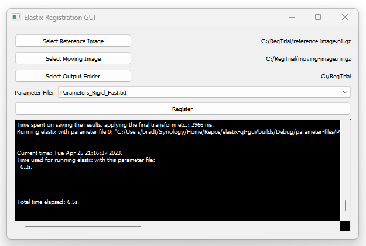

# Elastix Qt GUI

## Overview

Elastix Qt GUI is a simple graphical user interface based on Qt for calling the [elastix image registration toolbox](https://github.com/SuperElastix/elastix) (currently, only in Windows). This allows interactive usage in a lightweight package. 

The GUI allows users to select a reference image, a moving image, and an output folder using the operating system file browser. The registration parameter file is selected using a dropdown box. This is populated from the `*.txt` files stored in the `parameter-files` folder alongside `ElastixQtGui.exe`. If no files are found, a warning is displayed, and the application exits. When the "Register" button is selected, the `elastix.exe` command is called with the provided options, with the command output displayed within the GUI.

Before use, elastix should be downloaded and added to the system path. The latest elastix releases can be found [here](https://github.com/SuperElastix/elastix/releases). To update the system path in Windows, search for `Environment Variables` using the task bar, then `Environment Variables` -> `System variables` -> `Path` -> `Edit`. Add the folder containing `elastix.exe`.



## Building from source

To build the GUI application using cmake, open a command prompt (e.g., Visual Studio Command Prompt), navigate to the root folder of the repository and run (substituting the correct path to Qt):

```
cmake -B builds "." -DQt5_DIR="C:/PATH/TO/Qt/Qt5.15.5/lib/cmake/Qt5"
cmake --build builds/ --config Release
```

For debug builds, substitute `Release` with  `Debug`. Note, this also generates a Visual Studio `.sln` file in the `builds` directory.
